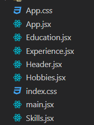
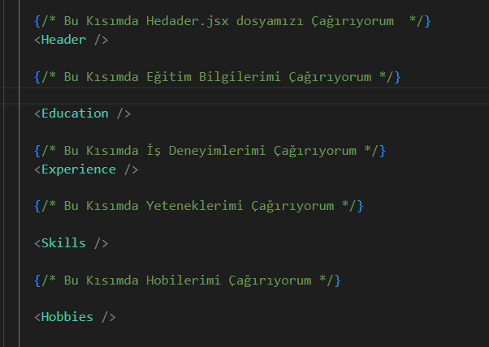

# React.js ile Uygulama Geliştirme CV Projesi
projeyi çalıştırmak için npm install yapmayı unutunmayın

### Proje Hakkında

Cv projesinde tasarımı yaparken parça parça her bölümü ayrı bir react dosyasında çağırdım ve her bir bölümü ayrı bir component olarak oluşturdum. Bu sayede kodları daha düzenli ve okunabilir hale getirmiş oldum. 

App.jsx dosyasında bu kısımları çağırarak ana componenti oluşturdum.

bu sayede kodları bir react projesine uygun ve düzenli bir şekilde yazmış oldum.

---

cv tasarımı içersinde sosyal medya linklerini kullanmak için iconları kullandım ve bu iconları react-icons kütüphanesinden aldım.

